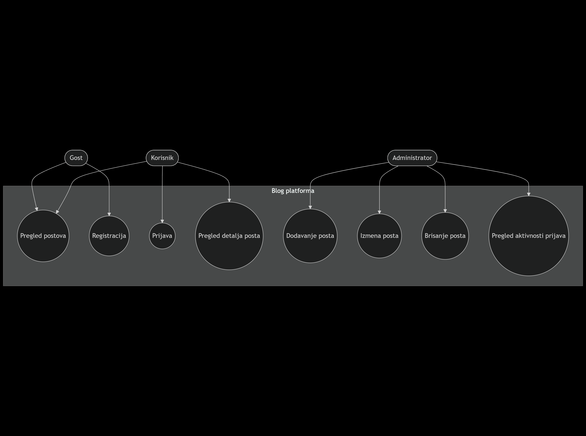
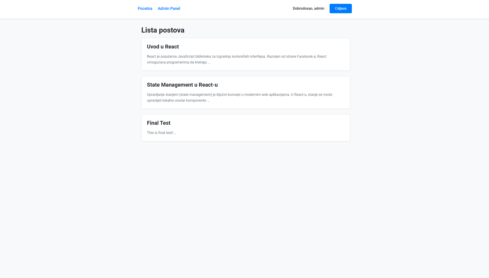
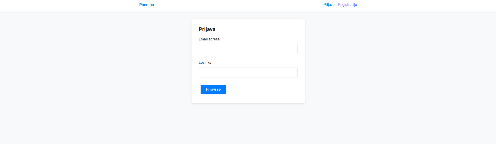
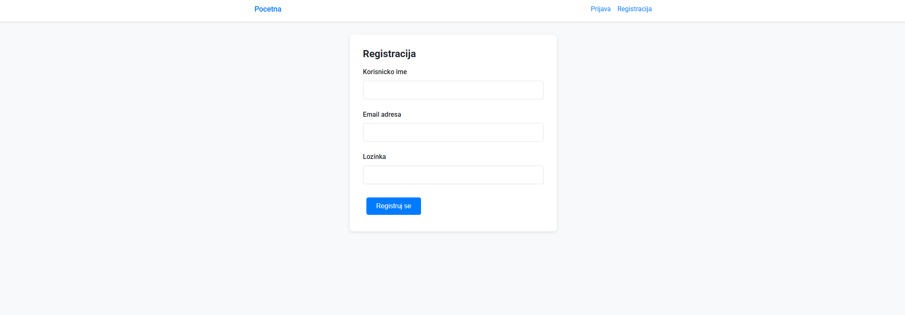
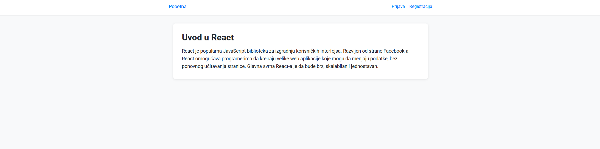
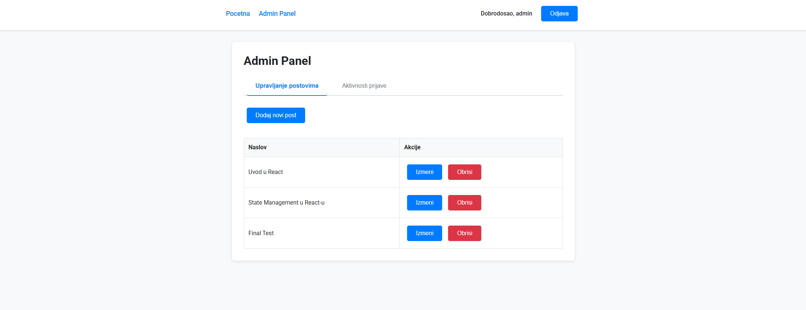
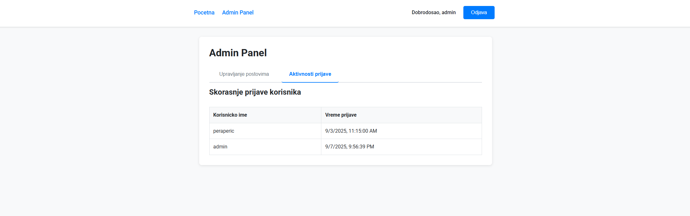

# Blog platforma

## Naslovna strana

**Fakultet:** *Metropolitan University*

**Smer i predmet:** *IT - IT354*

**Student:** *Lazar Nikolić*

**Indeks:** *5396*

**Naziv projekta:** Blog platforma

**Datum predaje:** *07.09.2025.*

---

## Sadržaj

* [1. Uvod](#1-uvod)
* [2. Planiranje i dizajn sistema](#2-planiranje-i-dizajn-sistema)

  * [2.1. Definicija zahteva](#21-definicija-zahteva)
  * [2.2. Use-case dijagrami](#22-use-case-dijagrami)
* [3. Razvoj korisničkog interfejsa (UI)](#3-razvoj-korisničkog-interfejsa-ui)

  * [3.1. Tehnologije za stilizaciju](#31-tehnologije-za-stilizaciju)
  * [3.2. Ključne stranice](#32-ključne-stranice)
* [4. Implementacija funkcionalnosti](#4-implementacija-funkcionalnosti)

  * [4.1. Korisničke funkcionalnosti](#41-korisničke-funkcionalnosti)
  * [4.2. Administratorske funkcionalnosti](#42-administratorske-funkcionalnosti)
* [5. Simulacija backend-a](#5-simulacija-backend-a)

  * [5.1. JSON Server](#51-json-server)
  * [5.2. Povezivanje frontenda i backend-a (API pozivi)](#52-povezivanje-frontenda-i-backend-a-api-pozivi)
  * [5.3. Alternativne tehnologije](#53-alternativne-tehnologije)
* [6. Zaključak](#6-zaključak)
* [7. Prilozi](#7-prilozi)

---

## 1. Uvod

**Opis teme:** Projekat **Blog platforma** je web aplikacija koja omogućava kreiranje, pregled i manipulaciju blog sadržajem. Aplikacija podržava više nivoa korisnika (registrovani korisnici i administratori).

**Cilj projekta:**

* Registracija i autentikacija korisnika.
* Pregled i interakcija sa blog postovima.
* Upravljanje sadržajem od strane administratora.

**Korišćene tehnologije i alati:**

* React.js (v19)
* React Router DOM
* Context API (autentikacija)
* Axios
* Formik & Yup
* CSS Modules
* JSON-server

---

## 2. Planiranje i dizajn sistema

### 2.1. Definicija zahteva

**Korisnici mogu:**

* Registracija i prijava.
* Pregled liste postova.
* Pregled detalja posta.

**Administratori mogu:**

* Dodavanje novih postova.
* Izmena postojećih postova.
* Brisanje postova.
* Praćenje aktivnosti prijava korisnika.

### 2.2. Use-case dijagrami

**Akteri:** Gost, Korisnik, Administrator.
Gost može da pregleda postove i registruje se. Korisnik se može prijaviti i koristiti aplikaciju. Administrator ima potpunu kontrolu nad sadržajem i aktivnostima.

[](./diagram.png)

---

## 3. Razvoj korisničkog interfejsa (UI)

### 3.1. Tehnologije za stilizaciju

Izabrani su **CSS Modules** jer pružaju izolovanost stilova i lakšu modularnost.

### 3.2. Ključne stranice

* **Početna stranica (HomePage.js):** lista svih postova sa naslovom i uvodom.
* **Login stranica (LoginPage.js):** prijava korisnika sa validacijom podataka.
* **Register stranica (RegisterPage.js):** registracija novih korisnika.
* **PostDetailPage:** detaljan prikaz sadržaja.
* **AdminDashboard:** panel za administratore sa CRUD funkcionalnostima i pregledom login aktivnosti.














---

## 4. Implementacija funkcionalnosti

### 4.1. Korisničke funkcionalnosti

* **Registracija:** koristi `registerUser` iz `api.js` i validaciju pomoću Formik/Yup.
* **Prijava:** koristi `loginUser`, zapisuje korisnika u `localStorage` kroz `AuthContext`.
* **Pregled podataka:** `fetchPosts` i `fetchPostById` za dohvat sadržaja.

### 4.2. Administratorske funkcionalnosti

* **Dodavanje novih elemenata:** `createPost` poziv.
* **Ažuriranje elemenata:** `updatePost`.
* **Brisanje:** `deletePost`.
* **Pregled aktivnosti:** `fetchLoginActivities`.

Kod primer (`services/api.js`):

```javascript
export const createPost = (postData) => API.post('/posts', postData);
export const updatePost = (id, postData) => API.put(`/posts/${id}`, postData);
export const deletePost = (id) => API.delete(`/posts/${id}`);
```

---

## 5. Simulacija backend-a

### 5.1. JSON Server

Pokretanje backend-a:

```bash
npm run server
```

**Primer db.json:**

```json
{
  "users": [
    { "id": 1, "username": "admin", "email": "admin@blog.com", "password": "adminpassword", "role": "admin" }
  ],
  "posts": [
    { "id": 1, "title": "Uvod u React", "content": "React je popularna biblioteka...", "authorId": 1, "createdAt": "2023-10-27T10:00:00Z" }
  ],
  "login_activities": []
}
```

### 5.2. Povezivanje frontenda i backend-a (API pozivi)

Frontend se pokreće:

```bash
npm start
```

API primeri (`services/api.js`):

```javascript
export const loginUser = (credentials) => API.get(`/users?email=${credentials.email}&password=${credentials.password}`);
export const fetchPosts = () => API.get('/posts?_sort=createdAt&_order=desc');
```

### 5.3. Alternativne tehnologije

Umesto JSON-servera moguće je koristiti realni backend (Express, Django, Spring Boot). U tom slučaju se menja `baseURL` u `api.js`.

---

## 6. Zaključak

**Rezultati:**

* Funkcionalna blog platforma sa korisnicima i administratorima.
* CRUD operacije i praćenje aktivnosti.

**Izazovi:** validacija formi, zaštita ruta, rad sa lokalnim skladištem.

**Buduća unapređenja:**

* Komentari po postovima.
* Paginacija i pretraga.
* JWT autentikacija.
* Povezivanje na pravu bazu.

---

## 7. Prilozi

* GitHub repozitorijum: *\[unesi link]*
